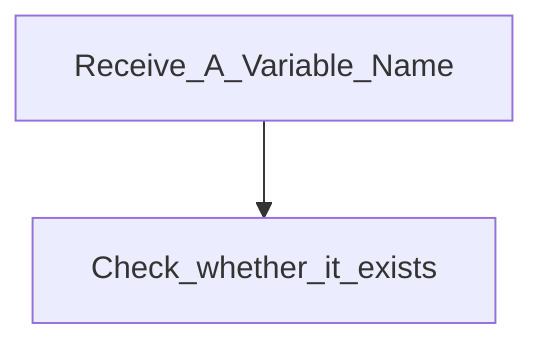

Function PART
===

## Functions 
- Check
- Save
- Delete

## Details
### 1. Check
- Receive variable name
	- type: string
- Return a struct
	- type
	- value
		- double
		- string
- Maintain heap and stack
	- heap for 

### 2. Save

### 3. Delete

## Logic

graph TD;
	A-->B;
, first check  whether it has been saved

## Problem